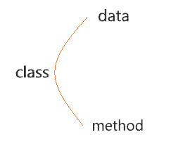
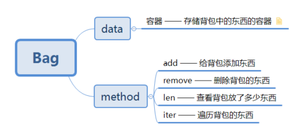

============================
1. 抽象数据类型和面向对象编程
============================

---------------------------------------------------------

抽象数据类型
===========================

理解之前先看看什么是抽象数据类型，请看下图：

 .. image:: ./chouxiang_1.png
  :width: 300px

首先实例化了一个 *list* 对象 *l*，然后通过 *VsCode* 的联想，我们能看到在 *l* 这个对象中有很多方法。
你还可以通过下面的方式将其打印出来：

>>> l = list() # 实例化对象l
>>> print(dir(l)) # 打印l中的方法
['__add__', '__class__', '__contains__', '__delattr__', '__delitem__', '__dir__', '__doc__', '__eq__', '__format__', '__ge__', '__getattribute__', '__getitem__', '__gt__', '__hash__', '__iadd__', \
'__imul__', '__init__', '__init_subclass__', '__iter__', '__le__', '__len__', '__lt__', '__mul__', '__ne__', '__new__', '__reduce__', '__reduce_ex__', '__repr__', '__reversed__', '__rmul__', '__setattr__', \
'__setitem__', '__sizeof__', '__str__', '__subclasshook__', 'append', 'clear', 'copy', 'count', 'extend', 'index', 'insert', 'pop', 'remove', 'reverse', 'sort']

为什么上面的 *l* 对象中会有这么多方法，那是因为将它实例化的 **数据结构**--*list* 里面就封装了这些方法。
这里的 *list* 对象就是一个抽象的数据类型(ADT)

------------------------------------------------------

实现规则
============================

见识了数据类型的奇妙，那么如何使用python代码构建自己的抽象数据类型呢？

其实你别看上面这么多方法，它都是有迹可循的

上图的结构是构建ADT必备的框架，其中：
 * **data** 是指 *class* 里面必要的基础属性，例如 *array* 中的数组长度
 * **method** 则是指 *class* 具备的一些方法，例如上述的 *list* 对象中就有 *append*、*len*、*clear* 等方法
 * 一个 *class* 应该具备哪些 *data* 和 *method* 需要根据实际的问题实际考虑

.. note::
 TIPS：
  上述所说的方法，你也可以称为函数，在 *python* 中方法和函数没有特别统一的区分，但如果是在某个对象中的函数，我们还是习惯于将它称为这个对象的方法。

---------------------------------------------------

实现举例
=========================

下面简单实现一个 *bag* (背包)的抽象数据类型吧，首先依据上面提到的实现规则看下图：

上图就是 *Bag* 这个数据类型所包含的基本内容，接下来就是如何用代码来具体实现了

::

    #coding-utf-8

    class Bag():
        def __init__(self, maxsize=10): # 指定背包的默认最大长度
            self.maxsize = maxsize
            self._items = list() # 实例化容器对象，这里使用list

        def __len__(self): # 求背包现有物品长度
            return len(self._items)
        
        def add(self, item):
            if len(self) >= self.maxsize: # add之前判断背包是否物品已满
                raise Exception('Bag is full')
            self._items.append(item)

        def remove(self, item):
            self._items.remove(item)

        def __iter__(self):
            for i in self._items: # yield惰性输出
                yield i

        def clear(self): # 清除
            self._items.clear()

    # 测试ADT
    bag = Bag()

    for i in range(5):
        bag.add(i)

    assert len(bag) == 5 # 断言判断

    bag.remove(2)

    assert len(bag) == 4

    bag.clear()

    assert len(bag) == 0

    for i in range(10):
        bag.add(i)

    assert len(bag) == 10

    try: # 异常捕获
        bag.add(0)
    except Exception as e:
        print('Bag is full ! ')

    print('用例执行完成')

上述代码虽然实现了一个 *Bag* 的类型，但是里面使用的代码效率上没有 *python* 自身的数据类型这么高。并且上述代码还有待完善的地方，比如
在 ``remove`` 方法中如果加上判断移除的元素是否存在会更好。

动手实践比空想实际的多，快自己动手写写吧！

------------------------------------

小结
===================================

书写抽象数据类型需要注意的一些地方：

.. warning::
 1. 选用正确的DataStructure，选择标准为：该数据结构能够操作method中所列出的方法
 2. 能否支持高效的操作，即代码的执行效率如何 （考虑时间、空间复杂度）

